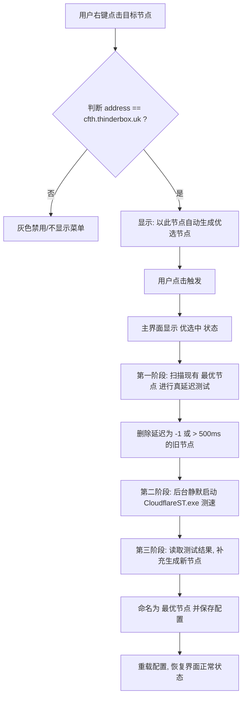

# 《v2rayN 自动优选 Cloudflare IP 功能需求说明书 (PRD)》

---

## 1. 需求背景与功能定位
针对使用 Cloudflare 作为中转的 VLESS+WS+TLS 节点，由于国内运营商对 Cloudflare Anycast IP 的干扰和封锁，用户需经常手动挑选并更换最快 IP。本功能旨在 v2rayN 内集成 Cloudflare 优选工具，提供一键自动优选、筛选过期节点和生成优选节点的功能，全面提升用户体验。

---

## 2. 业务流程与逻辑

### 2.1 业务流程图

---

## 3. 功能详细说明

### 3.1 界面交互 (UI/UX)
* **入口**：在 v2rayN 主界面的节点列表，用户选中某个节点并**右键点击**。
* **准入校验**：
  * 系统在弹出右键菜单前，校验选中节点的 `address` 属性。
  * 只有当 `address == "cfth.thinderbox.uk"` 时，才显示菜单项：**“以此节点自动生成优选节点”**。若不符合，该菜单项为置灰（Disabled）或隐藏状态。
* **状态反馈**：
  * 用户点击该选项后，右键菜单关闭，主界面相应位置或右键菜单条目显示 **“优选中...”** 提示。
  * 优选全程在后台**完全静默运行**，不弹出任何黑色的命令行窗口。
  * 优选及配置保存完成后，“优选中...” 提示自动消失，主界面刷新列表。

### 3.2 节点清理机制 (Pre-Cleanup)
在启动新一轮测速前，系统需对现有的优选节点进行一次“优胜劣汰”筛选：
1. **识别旧节点**：筛选出所有 `remarks == "最优节点"` 的配置项。
2. **真延迟测试**：
   * 对这些节点执行一次真连接延迟测试（等同于 v2rayN 内置的 `Ctrl + R` 延迟测试，测试真实网页响应能力）。
3. **判定与删除**：
   * 延迟为 **`-1`（超时/不可达）** ➡️ **删除**。
   * 延迟 **`> 500ms`（严重延迟）** ➡️ **删除**。
   * 延迟 **`<= 500ms`** ➡️ **保留**，不做改动。

### 3.3 测速执行与生成机制 (Execution & Generation)
1. **调用参数**：
   * 系统静默启动内置的 `CloudflareST.exe`。
   * 采用 CloudflareSpeedTest 默认推荐测速参数运行，以确保测速精确度。
2. **节点补充**：
   * 设上限为生成 50 个节点。
   * **补充生成数量 = 50 - 保留的节点数**。
   * 按照测速排行，选取排在前列的优选 IP，克隆模板节点（即最初右键选中的那个节点）。
3. **节点字段写入规则**：
   * `remarks` ➡️ 统一命名为 **`最优节点`**。
   * `address` ➡️ 写入优选出的 **Cloudflare IP**。
   * `requestHost` (Host) ➡️ 必须保持为模板节点的 **`cfth.thinderbox.uk`**。
   * `sni` (SNI/ServerName) ➡️ 必须保持为模板节点的 **`cfth.thinderbox.uk`**。

---

## 4. 技术与非功能性要求

### 4.1 程序包集成与更新
* **内置打包**：`CloudflareST.exe` 二进制文件与 v2rayN 安装包一同打包分发。
* **更新机制**：
  * 考虑到部分用户处在 GitHub 无法正常访问的网络环境中，更新机制需支持**备用源（镜像源）**。
  * 软件需内置指向国内可访问镜像（如 Gitee 镜像、私有服务器源或国内 CDN 镜像）的下载接口，以便一键检测并更新 `CloudflareST` 程序。

### 4.2 配置并发控制
* 在“优选中...”状态未结束前，系统需拦截用户的二次优选触发，避免多重 `CloudflareST.exe` 进程在后台并发运行导致带宽抢占和测速失准。
